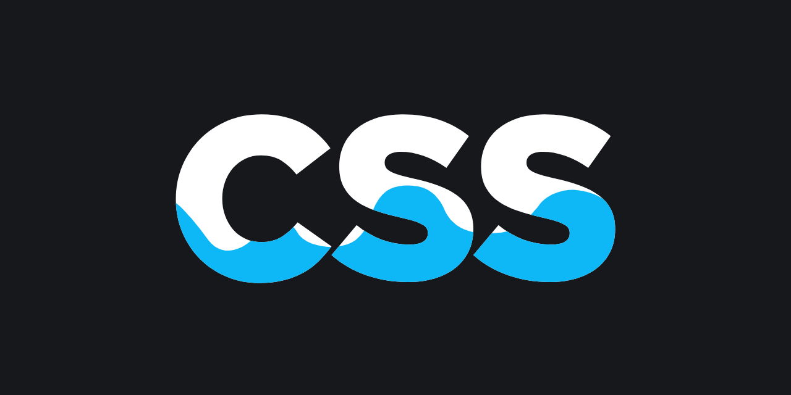

# My First Project (Photo Gallery)
Hallo. Ich habe eine Photo Gallery als mein erstes Project gestellt.
## Was ist hier zu sehen und lernen:
- Eine transparente Background Image erstellen.
- FontAwesome Icons hinzufügen mit eine **Pulse Grow** Hover Effect
- A Photo Gallery mit a Text **Overlay** über Images.
- Text Shadows/ Box Shadows  and Animations.
- @Keyframes
- Google Fonts

## Bilt mit:
- 
- 
## Setup:
1. Kolnen Sie das Repository auf Ihren Computer.
2. Kopieren Sie das SSH (git@github.com:NaheedaTokhi/Photo-Gallery-NaheedaTokhi.git)
3. Offnen Sie das index.html Datei in einem Webbrowser, um die Photo Gallery zu shauen.
4. Um die Galerie anzupassen, bearbeiten Sie die HTML- und CSS-Datei nach Ihren Wünschen. Sie können Bilder hinzufügen oder entfernen, Stile anpassen und das Layout nach Bedarf ändern

## Vorschau Images:

## Beitragen:
Beiträge zur Verbesserung der Bildergalerie sind willkommen. wenn Sie Vorschläge, Fehlerbehebungen oder Funktionswünsche haben. Fühlen Sie sich frei, ein Problem zu eröffnen oder eine Pull Anfrage einzureichen.

## Erstellerin:
Naheeda Tokhi

## License
Verteilt unter der MIT-Lizenz. Weitere Informationen finden Sie unter LICENSE.txt .
